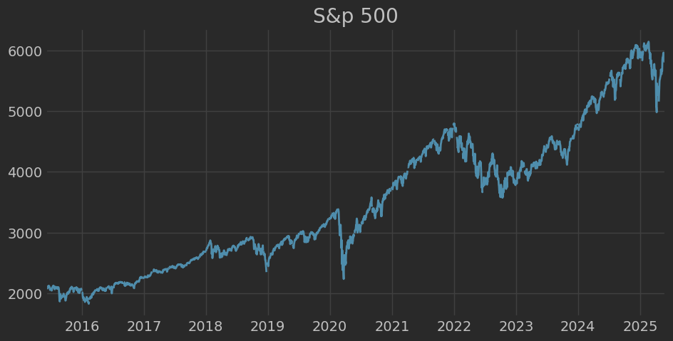
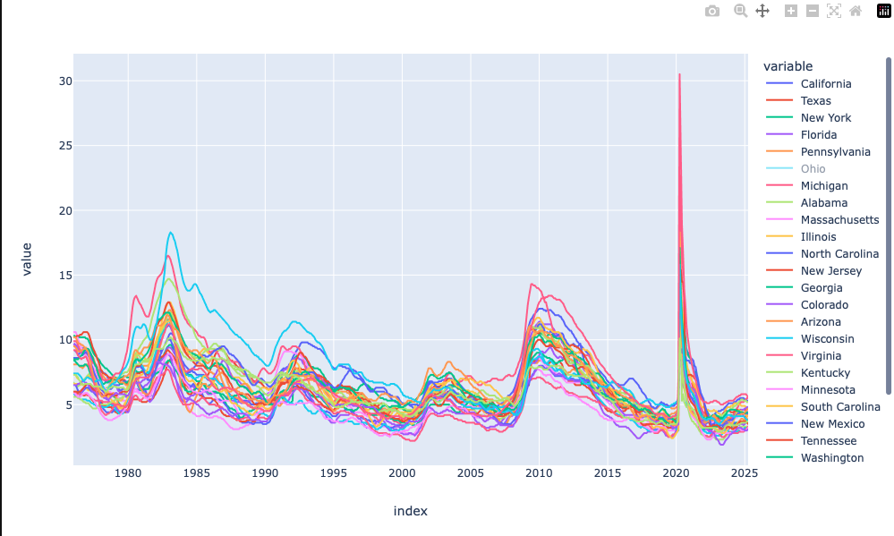
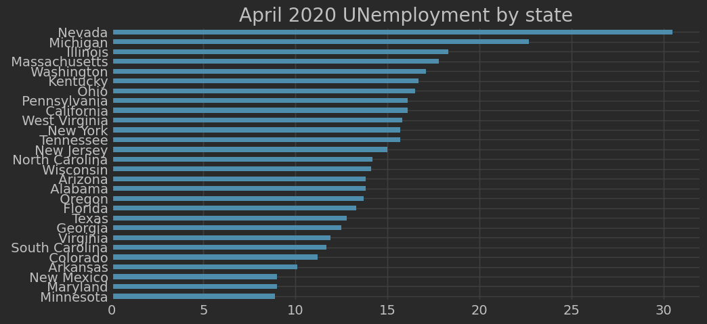
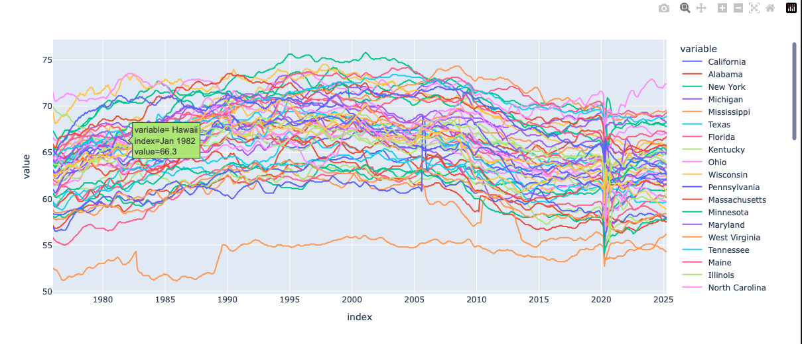
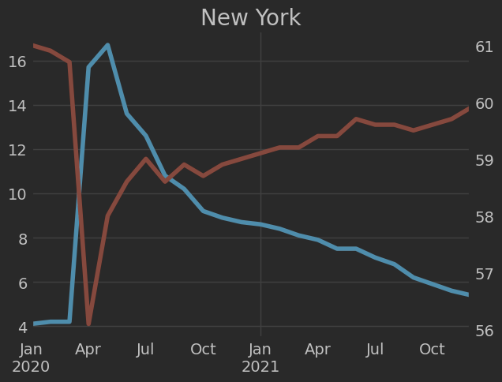

# Economic Data Analysis with FRED API

This Jupyter notebook provides a comprehensive analysis of U.S. economic indicators using the [Federal Reserve Economic Data (FRED)](https://fred.stlouisfed.org/) API. The focus is on visualizing unemployment rates and labor force participation rates across U.S. states, with a deep dive into trends during the COVID-19 pandemic.

## Features

- Connects to the FRED API using a secure API key.
- Searches and retrieves:
  - S&P 500 index data
  - State-level unemployment rates
  - State-level labor force participation rates
- Visualizations include:
  - S&P 500 time series  
    
  - Unemployment rates by state  
    
  - April 2020 unemployment snapshot  
    
  - Participation rates across states  
    
  - Unemployment vs. Participation comparison plots  
    

## Setup

Follow these steps to set up and run the notebook:

### 1. Clone the Repository

```bash
git clone https://github.com/your-username/your-repo-name.git
cd your-repo-name

### 2. Install Dependencies

Make sure you have Python 3.x installed, then run:

```bash
pip install pandas numpy matplotlib plotly pyyaml fredapi
```

Or use a `requirements.txt` if available:

```bash
pip install -r requirements.txt
```

### 3. Get a FRED API Key

- Visit [https://fred.stlouisfed.org/](https://fred.stlouisfed.org/)
- Log in or register for a free account
- Navigate to **My Account > API Keys** and generate a key
- Save it in a file named `api_key.yml` in your project root with this content:


